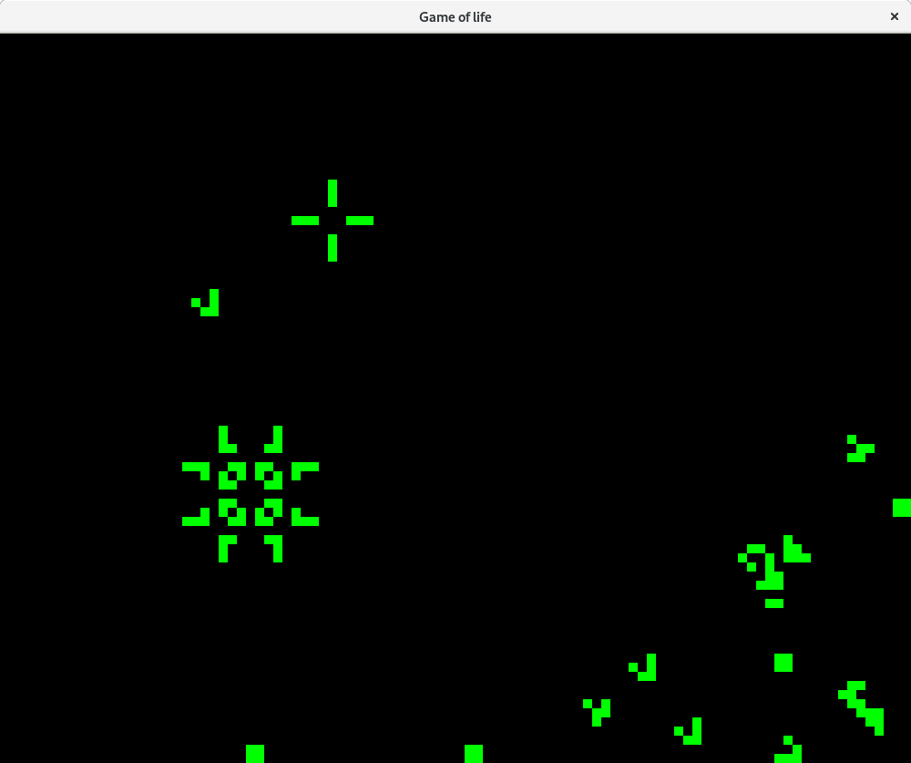

Game of life written in C++ / OpenGL.
Tested only on archlinux.

I've tried to create sort of graphical engine based on OpenGL and abstruct all OpenGL and glew stuff to make it easier to use.
mygl folder has its source.

For now you can pause/unpause, pressing space, press N for next iteration, invert cell with left mouse button and create glider with right mouse button.

